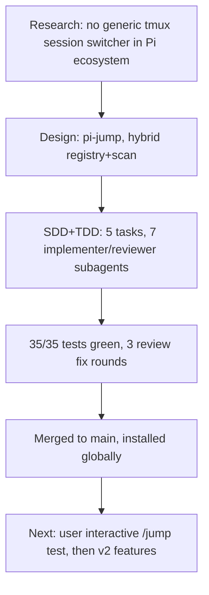

## What

- Built `pi-jump` extension: `/jump` picker lists live pi sessions across tmux windows, Enter runs `tmux switch-client -t session:window`.
- Hybrid discovery: self-registry `~/.pi/agent/tmux-registry.json` + process scan fallback (ps BFS for `pi` binary + lsof cwd).
- Executed via SDD: worktree, ledger, fresh implementer per task (Kimi K2.7), reviewer per task, final whole-branch review (K3), fix waves. Strict TDD: tests-first everywhere, 35/35 green.
- Code: `/Users/sagar/work/pi-tmux-conf/{index.ts,src/*.ts,tests/*.ts}` — merged to main (merge commit 6ee0474). Installed at `~/.pi/agent/extensions/pi-jump/`.

## Key Takeaways

- `tmux display-message -p` without `-t` reports the **client's active pane**, not the running pane — must use `-t $TMUX_PANE`. Caught only in live verification.
- `pi.exec` resolves with `code≠0` on failure — never throws on nonzero exit; must check `.code` before trusting stdout (registry-wipe bug class).
- pi runs as compiled binary, `comm === "pi"` in ps; subagent pi instances also self-register (noise, auto-pruned).
- Full SDD loop for ~700 LOC: 5 tasks, 2 task-level fix rounds, 1 final fix wave — all findings resolved, none parked as load-bearing.

## Issues

- pi-types.d.ts is a hand-written stub (package types not locally resolvable) — drift risk.
- Interactive `/jump` path (ui.select → switch-client) not exercisable headless; verified only by module tests + live registry writes.

## Decisions

- v1 = jump only; kill/new/rename/bookmarks/status-widget deferred to v2.
- LWW JSON registry (no locking) accepted — writes only on session_start.
- Merge strategy: --no-ff merge to main, branch deleted.

## Next

1. User: `/reload` in a running pi, then `/jump` — confirm picker + switch works interactively.
2. If good → v2 candidates (design doc "Deferred" section): kill pane, new session, fuzzy filter, status widget.
3. Optional hardening: `switch-client -c`, replace pi-types stub with real types via `npm i -D @earendil-works/pi-coding-agent`.
4. Package for sharing: add `pi` manifest + keyword `pi-package`, publish or `pi install git:...`.
