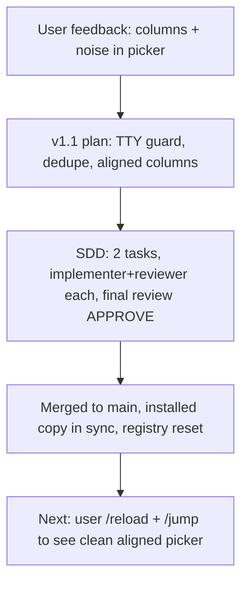

## What

- **A. TTY guard** (`src/guard.ts`): headless pi (`pi -p`, subagents) no longer self-register — kills `general-purpose#…` noise and duplicate-pane entries at the source.
- **B. Dedupe** (`dedupeByPane` in `src/discover.ts`): same pane → keep latest entry. Safety net.
- **C. Aligned columns** (`formatOptions` in `src/format.ts`): `{dot} {name padded} │ {target right-aligned} │ {age right-aligned}`, names truncated at 32 with `…`.
- 43/43 tests green, tsc clean. Merged `e2dda95` → main (merge commit). Installed at `~/.pi/agent/extensions/pi-jump/` verified in sync. Old noisy registry deleted (rebuilds clean on next session starts).

## Key Takeaways

- Headless pi inherits parent's `TMUX_PANE` → was registering junk entries; `process.stdout.isTTY` is the discriminator.
- Live-verified both directions: piped `pi -p` leaves registry absent; `script -q /dev/null pi -p` (pty) registers exactly one entry.
- Plan test-string off-by-one (right-align padding); implementer caught it — trust alignment math, not eyeballs.

## Issues

None open. Deferred from v1 still apply (see checkpoints/01): `switch-client -c`, pi-types stub, multi-socket tmux.

## Decisions

- Dropped D (current-project marker) — YAGNI for now.
- No ANSI colors in picker — ui.select renders plain strings.

## Next

1. User: `/reload` then `/jump` in any pi — confirm clean aligned picker, no subagent noise.
2. v2 candidates unchanged: kill/new session, fuzzy filter, status widget, packaging (`pi-package` manifest + publish).
