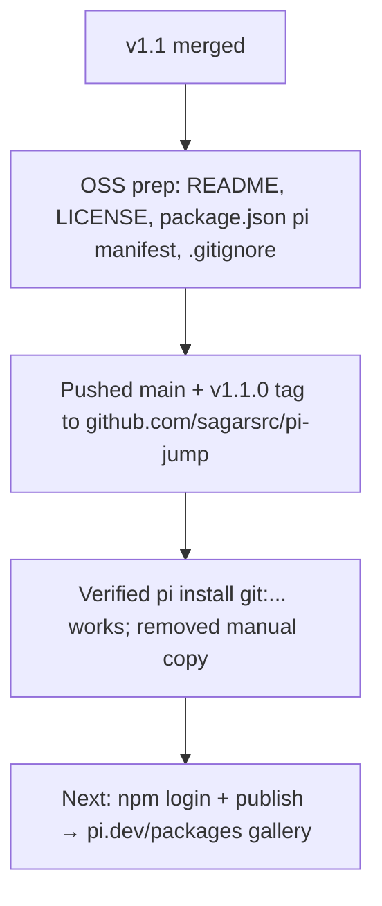

## What

- Repo open-sourced: https://github.com/sagarsrc/pi-jump (public, branch `main`, tag `v1.1.0`).
- Added: `README.md` (install/usage/how-it-works/roadmap), `LICENSE` (MIT, Sagar Sarkale 2026), `.gitignore` (node_modules, .superpowers), full `package.json` metadata: keywords incl. `pi-package`, `pi` manifest (`extensions: ["./index.ts"]`), `peerDependencies: @earendil-works/pi-coding-agent "*"`, `files` whitelist, version 1.1.0.
- Install path verified: `pi install git:github.com/sagarsrc/pi-jump@v1.1.0` works; old manual copy at `~/.pi/agent/extensions/pi-jump/` removed to avoid duplicate `/jump` registration. Now installed as managed package (cloned to `~/.pi/agent/git/github.com/sagarsrc/pi-jump`).
- npm name `pi-jump` is UNCLAIMED (404 on registry).

## Key Takeaways

- **pi.dev/packages gallery = npm-keyword driven**: gallery displays packages tagged with keyword `pi-package` in package.json. Docs (packages.md, "Gallery Metadata") describe npm keyword discoverability; git-only install works but gallery visibility needs the npm publish.
- Gallery preview: optional `pi.video` (MP4, autoplay on hover) / `pi.image` (PNG/JPEG/GIF/WebP) fields in package.json manifest.
- gh CLI authed as sagarsrc (ssh protocol); repo pre-existed empty on GitHub.

## Issues

- **npm NOT authenticated** (`npm whoami` → ENEEDAUTH). Publishing is the one step that needs the user: `npm login` (browser/OTP flow), then `npm publish` from repo root.
- package-lock.json is committed — fine for dev; npm publish uses `files` whitelist anyway.

## Decisions

- SSH remote (gh default), branch `main` (user requirement, was already main).
- Version 1.1.0 matches feature state (v1.1 picker polish).
- Kept `docs/` experiment folder in the public repo — development history is a feature (SDD/TDD trail).

## Next

1. USER: `npm login` then tell agent to run `npm publish` (or run it). Name `pi-jump` available.
2. After publish: verify appearance on https://pi.dev/packages (crawl timing unknown — check after some hours).
3. Optional: record MP4 demo of /jump picker → add `pi.video` URL to manifest → republish patch version.
4. Install instructions for users already in README (both git and npm paths).
