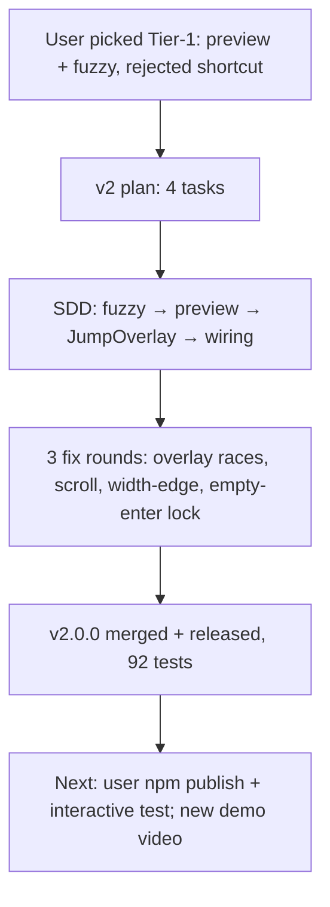

## What

- `/jump` picker is now a custom `JumpOverlay` component (ctx.ui.custom): fuzzy filter input + live `tmux capture-pane` preview below the list.
- New modules: `src/fuzzy.ts` (subsequence scorer +4 consecutive +6 start bonus), `src/preview.ts` (cleanPreview tail-20), `src/overlay.ts` (JumpOverlay: stacked layout, scroll window 10, debounce 150ms, stale-token guard, dispose).
- 92/92 tests, tsc clean. Merged to main, tag v2.0.0, GitHub release created.
- User constraint honored: tmux `session:window` never truncated — width-aware row composition (drop cwd → drop age → truncate name; backstop only at pathological widths).

## Key Takeaways

- pi-tui host: factory return goes straight into editorContainer; host does NOT auto-render after handleInput → component must call `tui.requestRender()`; host calls `component.dispose?.()` on close — implement dispose (timer cleanup).
- matchesKey receives canonical key names ("enter", "escape", "up", "down", "backspace"); tests mock pi-tui (peer, not installed).
- Review found real UX traps: enter-on-empty-list locked overlay; narrow widths cut the tmux target; superseded preview promises hung waitForPreview.

## Issues

- pi-types.d.ts ui.custom stub is hand-written (validated by final reviewer against installed host).
- Overlay tests mock pi-tui — key-byte fidelity gap accepted.
- Interactive path (real TUI) not yet user-verified at time of writing.

## Decisions

- Stacked layout (list full-width, preview below) instead of side-by-side — side-by-side would truncate tmux target, violating user constraint.
- Shortcut keybinding rejected by user (defeats Ctrl-B-w avoidance? user call).
- v2.1 candidates: footer status widget; v2.2: kill/new session.

## Next

1. USER: `npm publish` (v2.0.0) then `pi remove <local>` if local installed + `pi install npm:pi-jump`, `/reload`, `/jump` — verify interactive overlay (filter + preview + jump).
2. Record NEW demo video showing filter + preview → attach to v2.0.0 release → update pi.video (patch v2.0.1).
3. Check pi.dev/packages listing for pi-jump crawl status.
