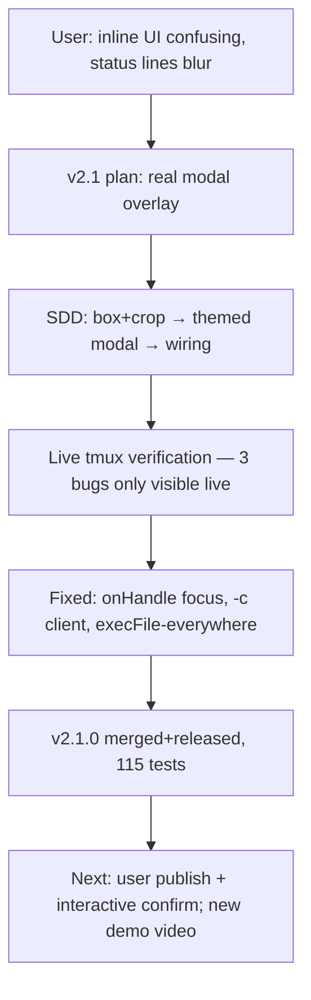

## What

- `/jump` is now a bordered floating modal (ctx.ui.custom `{overlay:true}`, anchor center, 80% width): `╭─ ◈ pi-jump ─╮` title, selectedBg full-row highlight, labeled preview divider `┄ preview: name (target) ┄`, dim footer hints.
- Preview crops bottom 4 lines (PREVIEW_CHROME_CROP) — target pi's status line/prompt no longer shown.
- Visible-width-safe layout (padToWidth via pi-tui visibleWidth; CJK/emoji names).
- Multi-client-safe jump: `switch-client -c <owning client tty>`.

## Key Takeaways (live-only bugs — all fixed)

1. **overlay:true does NOT auto-focus** — keys go to editor behind. Fix: `onHandle: h => h.focus()`.
2. **bare switch-client picks arbitrary client** with 3+ clients attached. Fix: resolve owning client via `display-message -t $TMUX_PANE '#{client_tty}'`, pass `-c`.
3. **pi.exec hangs around ui.custom lifetime** (during AND right after). Fix: ALL external commands via child_process execFile (`run()` helper). Never use pi.exec in extensions with custom UI.
4. tmux window indices drift when user creates/closes windows — target panes by ID (%N), never session:index, in automation.

## Issues

- Parked minors: dead `truncate` import in overlay.ts, box.ts/renderTop duplication drift, indent style.
- Modal width renders narrow-ish in split panes (80% of pane width) — acceptable.

## Decisions

- Theme cast `theme as JumpTheme` adjudicated safe — matches documented pi theming API exactly.
- Constant 26-line frame (MODAL_FRAME_LINES) retained from v2.0.1 clipping lesson.

## Next

1. USER: `pi remove /Users/sagar/work/pi-tmux-conf-wt-v21` (dev install), `npm publish` (2.1.0), `pi install npm:pi-jump`, `/reload`, `/jump` — confirm modal feels right.
2. Record NEW demo video of modal → attach to release → pi.video update (patch 2.1.1).
3. Parked minors cleanup in some future patch.
