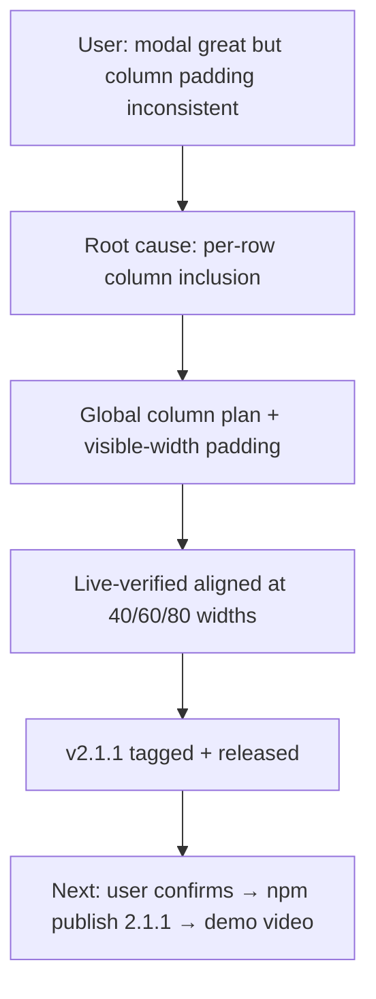

## What

- Fixed zigzag columns in the modal: row composition dropped cwd/age PER ROW based on each row's own length → separators misaligned row to row (e.g. `│ w:2 │` vs `│ work:1 │`).
- Now: `columnPlan(contentW)` decides column inclusion GLOBALLY from widest content; every row width-padded via visible-width helpers (`padToWidth`/`padStartToWidth`); name truncation with …, tmux target still sacred.
- Column widths now computed with `visibleWidth` in overlay constructor (was raw `.length` via format.ts computeColumnWidths — kept for formatOptions compat).
- 117/117 tests. Live-verified in scratch tmux pi at multiple widths. Tagged `v2.1.1`, GitHub release created, pushed.

## Key Takeaways

- Debug technique that worked: temporary zz-dbg.test.ts printing actual render output at widths 40/60/80 — caught exact misalignment pattern in seconds vs reading code.
- Modal at narrow pane widths (~38 cols) drops cwd+age columns GLOBALLY now — consistent.
- Local install = path install (`../../work/pi-tmux-conf`) → always live repo code; user only needs /reload.

## Issues

- npm registry still on 2.0.1 code (latest tag: check `npm dist-tag ls pi-jump`); 2.1.x NOT published yet — pending user `npm publish` (2FA).
- Parked minors from v2.1 review still open: dead `truncate` import? (removed in this fix — verify), box.ts/renderTop drift, indent style.

## Decisions

- No pi-tui import added to format.ts (tests/format.test.ts has no pi-tui mock → would break). Widths computed locally in overlay instead.

## Next

1. USER: /reload → /jump → confirm padding. Then:
   `pi remove /Users/sagar/work/pi-tmux-conf && npm publish && pi install npm:pi-jump`
2. Record demo video of modal → attach to v2.1.1 release → update pi.video (patch 2.1.2 if manifest changes).
3. Gallery check: https://pi.dev/packages/pi-jump after crawl.
